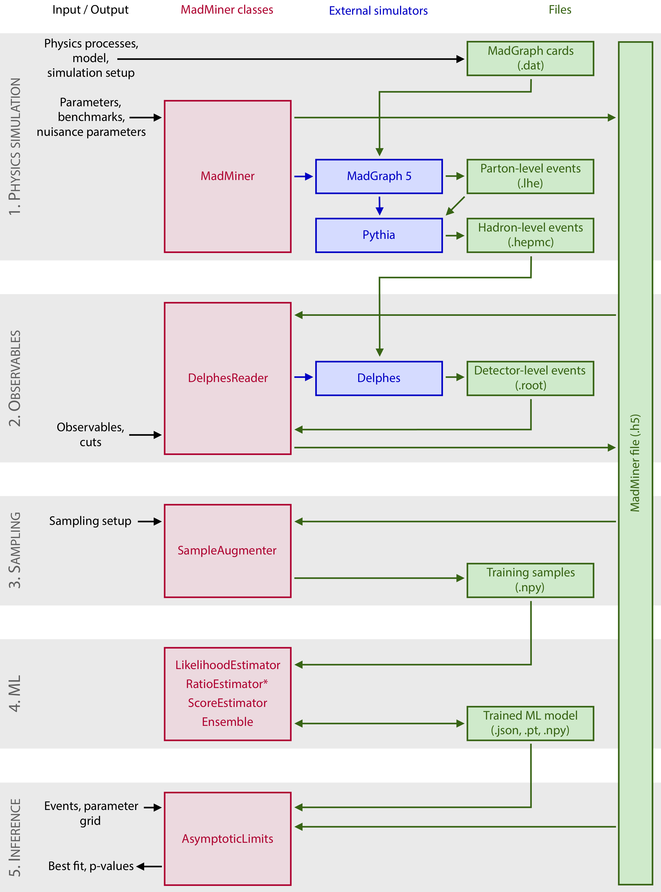

# EFT analysis
Example user story with madminer implementation

## Introduction

User specifies high-level physics choices:

 - A specific physics model (UFO/madgraph model specification) describing an effective field theory, a specific interaction process, and details of the simulaion setup (eg. center of mass energy etc.)
 - benchmark parameters to study in the physics model (eg. which EFT coefficients)
 - observables to be used in ML analysis and pre-selection cuts

User specifies some technical details: 
 - sampling setup
 - parameter grid/mesh for making plots

Tool provides: 
 - approximate likelihood ratios etc. for use in statistical analysis
 - results of statisitcal tools using the approximate likelihoods

Comments:
 - In this figure the MadMiner tool is handeling the simulation chain, and the user provides observed events after pre-selection cuts etc. that need to be consistently formatted etc. 
 - the preselection cuts and that pipeline could be specified and implemented in a separate declarative specfification. 

 Note: this figure is taken from draft paper for MadMiner tool.