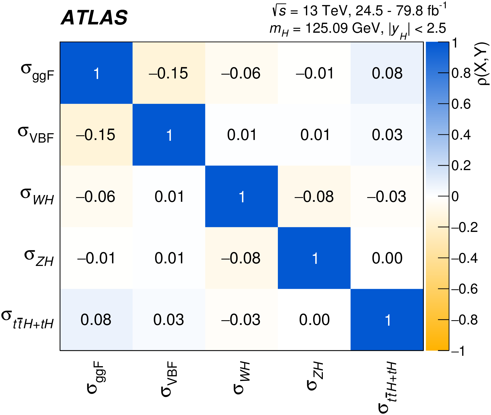

# Correlation matrix

## User story
As an analyzer, I want to know how correlated parameters in my measurement are.
This is done to inform the design of my measurement accordingly, and to help others who look at the measurement interpret it better.

### Assumptions
- A list of parameters and their linear correlations are provided in a well-defined format.

### Acceptance criteria
- A suitable diverging color map is used, in agreement with the study [Diverging Color Maps for Scientific Visualization](https://www.kennethmoreland.com/color-maps/).
- A threshold can be defined to automatically exclude parameters from the visualization, given that their correlation with all other parameters is below this threshold.

## Example implementation

Reference: reference: [CERN-EP-2019-097, submitted to Phys. Rev. D](https://inspirehep.net/record/1752936)

The figure visualizes the linear correlations between various parameters as determined by a fit.
A diverging color scale is used to distinguish between positive and negative correlations.