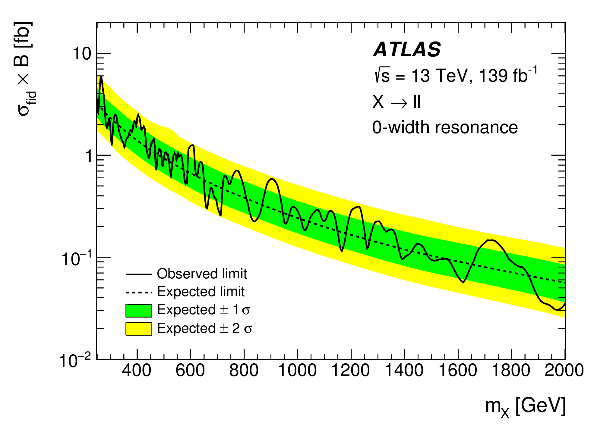
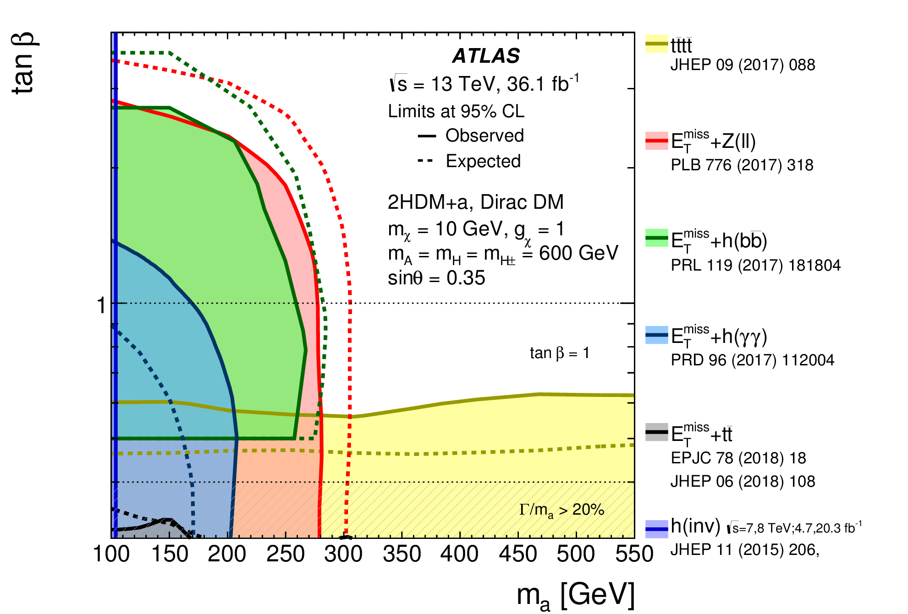

# Exclusion limits

## User story
As an analyzer, I want to visualize the exclusion limits obtained in my analysis, so that I can summarize key results of my measurement and present them to others.

### Assumptions
- Exclusion limits have been calculated and are provided in a well-defined format.

### Acceptance criteria
- Multiple limits can be visualized in the same figure, including measurements with data, expected limits or reference predictions.
- Limits can be shown as a function of a parameter, or separately for different fit configurations.

## Example implementation

### No dependence on other parameters

Reference: [Phys.Rev. D97 (2018) no.7, 072016](https://doi.org/10.1103/PhysRevD.97.072016)

The figure shows limits of a signal strength.
The expected limit is shown as a dashed black line, with the 1σ and 2σ confidence intervals indicated with green and yellow bands respectively.
The expected limit under another assumption is shown as a dashed red line.
The solid black line shows the observed limit.
The three different rows visualize the limits for the parameter in three different configurations.

### As a function of a continuous parameter

Reference: [Phys. Lett. B 796 (2019) 68](https://doi.org/10.1016/j.physletb.2019.07.016)

The figure shows limits of a cross section times a branching ratio, as a function of a mass.
Both expected and observed limits are drawn, like for the case above.

### As a function of two continuous parameters

Reference: [JHEP 05 (2019) 142](https://doi.org/10.1007/JHEP05(2019)142)

Exclusion limits from different analyses are shown in a two-dimensional plane.
Both expected and observed limits are shown on the figure.