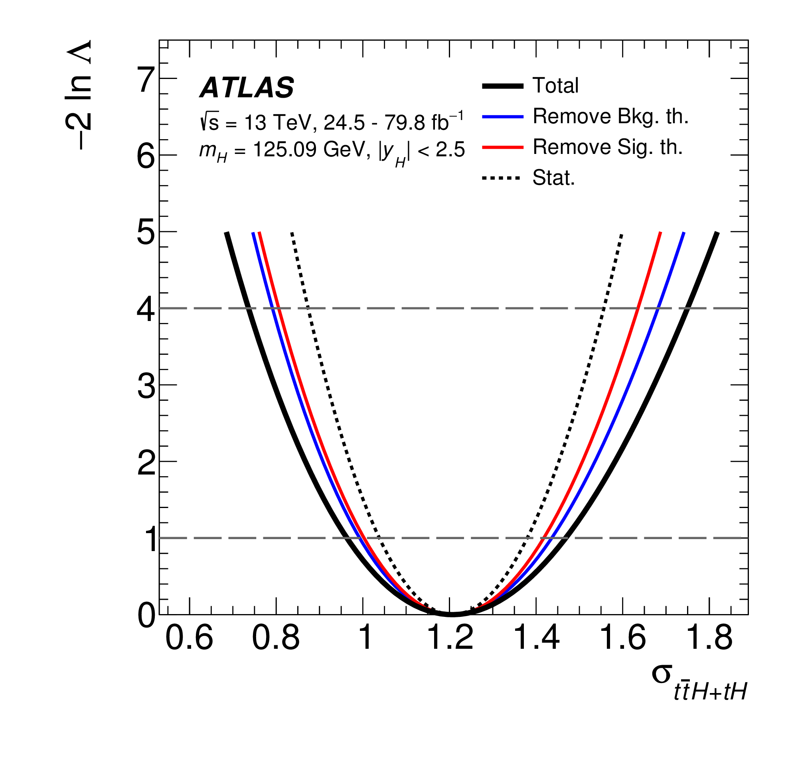
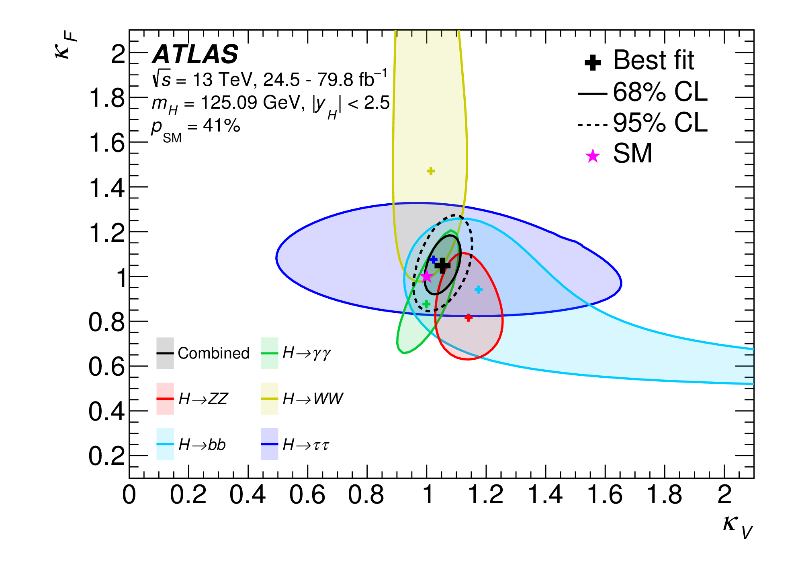

# Likelihood scan and contours

## User story
As an analyzer, I want to visualize a test statistic distribution around its minimum to present the results of my fit.

### Assumptions
- The distribution is supplied in a well-defined format.

### Acceptance criteria
- For one-dimensional cases, the test statistic distribution is visualized and can be intersected with horizontal lines to show confidence intervals.
- For two-dimensional cases, contours are drawn where the distribution intersects specific values, corresponding e.g. to the 68% and 95% confidence levels.
- Multiple distributions can be shown on the same figure.
- The best-fit point can be visualized for each distribution in the two-dimensional case.
- Reference points (e.g. expected minima) can be visualized in distributions.

## Example implementation

Reference: [CERN-EP-2019-097, submitted to Phys. Rev. D](https://inspirehep.net/record/1752936)

The distribution of -2 ln Λ, based on profile likelihood ratio Λ, is shown as a function of a cross-section σ.
Multiple lines visualize the distribution when considering all or only some sources of uncertainty.
The horizontal lines intersecting with the distributions visualize the 1σ and 2σ confidence intervals.

Reference: [CERN-EP-2019-097, submitted to Phys. Rev. D](https://inspirehep.net/record/1752936)

The figure shows expected 68% and 95% confidence level contours as a function of two parameters.
The best-fit points are highlighted for each distribution, and the expected best-fit point is shown as a star.