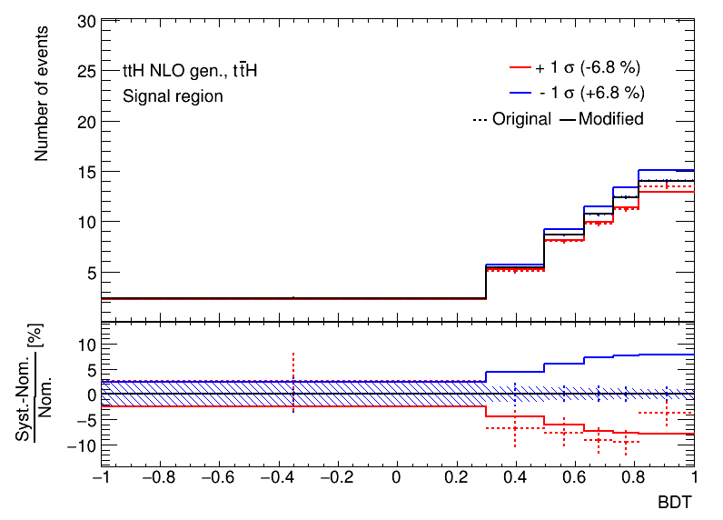

# Nuisance parameter effects

## User story
As an analyzer, I want to see the effect of a nuisance parameter on the distribution it acts on, so that I can validate the implementation and identify possible issues.

### Assumptions
- Both the nominal distribution and distribution(s) obtained when varying the nuisance parameter are provided.
- Additional distributions are provided when further processing, such as smoothing or symmetrization, is applied to the templates, in order to track the effect of the additional processing.
- The relevant information is supplied in a well-defined format.

### Acceptance criteria
- The visualization shows the original template before further processing steps are applied, and also the final template after additional processing steps in case it differs from the original.
- Statistical uncertainties for all distributions are drawn.

## Example implementation

Reference: Toy example built with TRExFitter

The effect of varying a nuisance parameter ("ttH NLO gen.") on a sample ("ttH") is shown for one channel ("signal region"), as a function of the variable ("BDT") along which bins are defined in this channel.
The solid black line in the upper panel shows the nominal distribution.
The dashed red points show the distribution when varying the nuisance parameter to +1 σ, before any additional processing is applied.
The solid red line visualizes the distribution after a smoothing has been applied to it.
The solid blue line shows the effect of varying the nuisance parameter to -1 σ, it is obtained by symmetrizing the effect of the +1 σ direction.
The legend furthermore shows the total normalization effect when varying the nuisance parameter to ±1 σ.