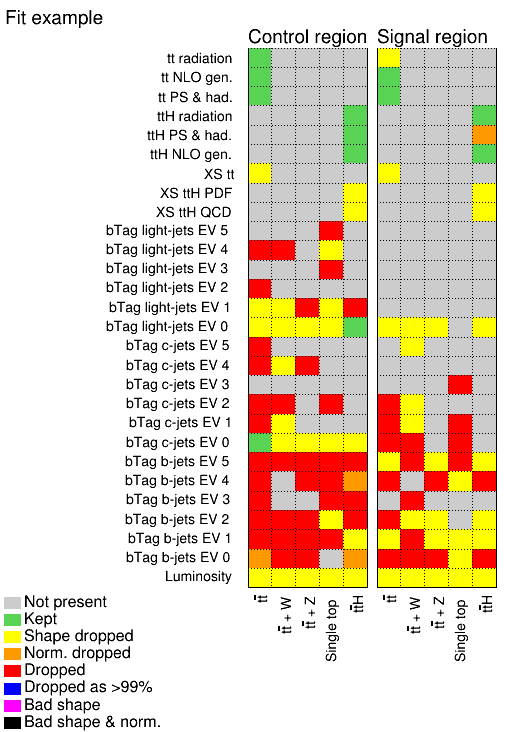

# Pruning plot

## User story
As an analyzer, I want to see a breakdown of which nuisance parameters are pruned, so that I can validate that the effects of the pruning procedure are reasonable.

### Assumptions
- A pruning procedure is implemented and has been used, and the results from it are available.

### Acceptance criteria
- The visualization shows all pruning decisions taken for the full fit model.
- When the pruning depends on more than two degrees of freedom (e.g. the pruning decision depends on the nuisance parameter and sample and channel), then there are multiple possible ways implemented to visualize this. For this example, a visualization may be one matrix per channel, and then many matrices for many channels, or one matrix per sample, and many matrices for many samples.

## Example implementation

Reference: Toy example built with TRExFitter

The figure shows a two-dimensional grid for each channel (also called region) entering the fit.
Different nuisance parameters are listed along the vertical axis, while samples are on the horizontal axis.
The color in each field determines which kind (if any) of pruning is applied to the nuisance parameter acting on a specific sample in a specific channel.
For each field, one figure can be drawn visualizing the effect of the nuisance parameter (see [nuisance parameter effects](nuisance-parameter-effects.md)).
This figure also flags potentially problematic nuisance parameters, which have been identified via an algorithm.