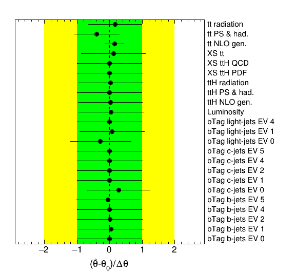

# Pull plot

## User story
As an analyzer, I want to see an overview of the fit result for all nuisance parameters, so that I can understand the fit better and compare different results quickly.

### Assumptions
- The fit results for all parameters are supplied in a well-defined format.
- If metadata exists that groups nuisance parameters together, it is also supplied in a well-defined format.
- Even when the pre-fit uncertainty Δθ for a nuisance parameter is not well-defined (e.g. for free-floating parameters), some value is provided for it.

### Acceptance criteria
- The best-fit point and uncertainty is visualized for every nuisance parameter.
- It is possible to group nuisance parameters together if optional metadata is supplied which provides grouping information.
- A custom order can be specified for the nuisance parameters.
- It is possible to overlay the results from multiple fits, in order to easily see their differences.

## Example implementation

Reference: Toy example built with TRExFitter

One nuisance parameter is shown per row, with the best-fit point drawn as a black circle.
The horizontal axis quantifies the pull of each nuisance parameter, which is its distance from zero.
The horizontal lines for each nuisance parameter show its post-fit uncertainty.