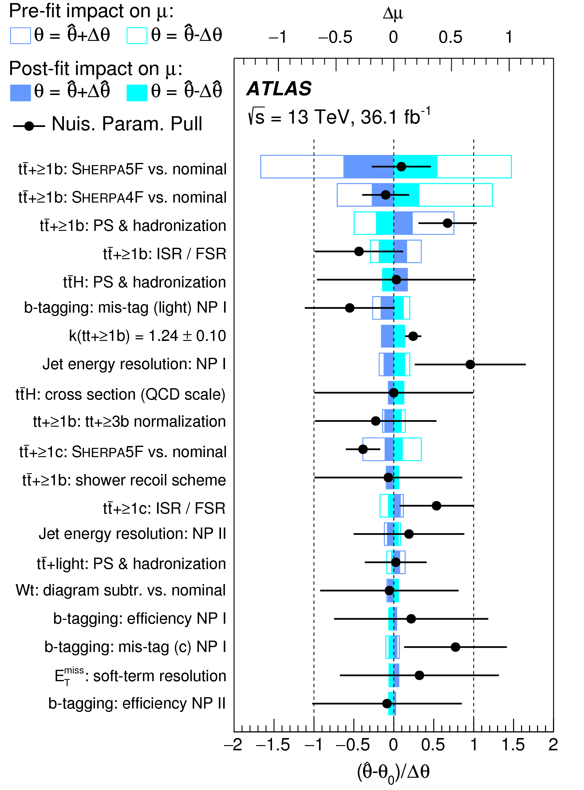

# Ranking plot

## User story
As an analyser, I want to see which nuisance parameters contribute most to the uncertainty on the parameter(s) of interest that I am measuring.
This is done so I can understand what limits the precision of my measurement, and which aspects of the statistical analysis should receive the most scrutiny.

### Assumptions
- The evaluation of the impact of each nuisance parameter is defined.
- The impact per nuisance parameter is calculated and provided in a well-defined format.
- A way to rank nuisance parameters by impact is defined.
- If the nuisance parameter _pulls_ are also shown, they are provided in a well-defined format (see also the section on [pull plots](pull-plot.md)).
- For measurements with more than one parameter of interest, there is either a way to show the impact with respect to every parameter of interest, or a way to combine it into a single quantity for multiple parameters of interest.
- The visualization of the pre-fit impact is agnostic to how this impact was evaluated, as it may have to be manually specified in cases where it is not well-defined (such as for free-floating nuisance parameters).

### Acceptance criteria
- When ranking nuisance parameters in profile likelihood fits, both the pre- and the post-fit impact of each nuisance parameter is defined.
- If the pre-fit impact is not provided (for example for free-floating nuisance parameters), there is a way to exclude it from the visualization.

## Example implementation

Reference: [Phys.Rev. D97 (2018) no.7, 072016](https://doi.org/10.1103/PhysRevD.97.072016)

The figure depicts nuisance parameters in decreasing order of their impact on the parameter of interest in this measurement, which is called μ.
The impact is called Δμ, and the scale for it is given on the upper horizontal axis.
Pre- and post-fit impacts are visualized via empty and filled rectangles.
The impact is evaluated separately when varying each nuisance parameter in two directions, and shown with two different colors.
The pull of each nuisance parameter is overlaid on this figure, visualized similarly to how it is done for pull plots (see [pull plots](pull-plot.md)).
The pull is measured on the lower horizontal axis.