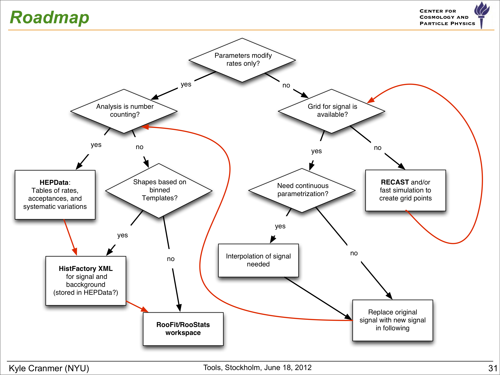
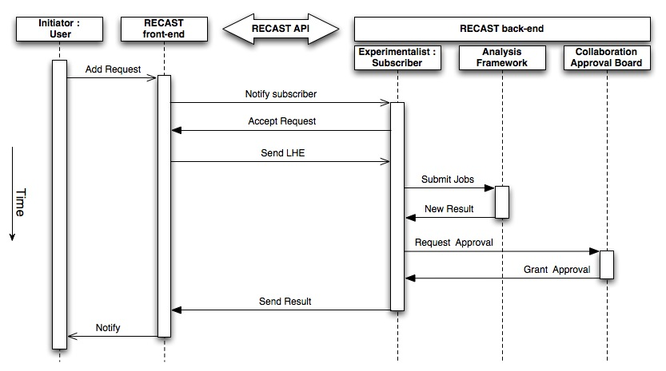
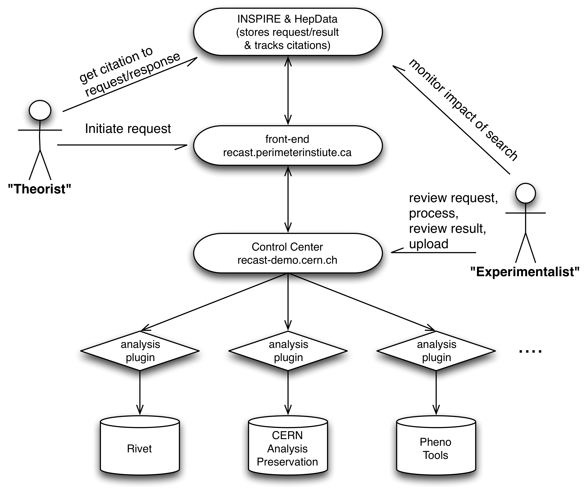

# Reinterpretation
Example user story for reinterpretation including cyberinfrastructure components like RECAST, HEPData, and [template fit](tempate-fit.md).

## Introduction

User wants to reinterpret a search or measurement. Below is a flowchart for satisfying the reinterpretation based on the type of analysis and which ingredients are available or need to be created.

## Cyberinfrastructure components

 - [RECAST paper](https://arxiv.org/pdf/1010.2506.pdf)
 - ["Open is Not Enough" paper](https://www.nature.com/articles/s41567-018-0342-2)
  - [CERN Analysis Preservation Portal](https://analysispreservation.cern.ch/login)
  - [REANA](http://www.reanahub.io)
  - [HEP Software Foundation Community White Paper Working Group - Data and Software Preservation to Enable Reuse](http://inspirehep.net/record/1697055)
  - [HEPData](http://inspirehep.net/record/1592380)
  - [Analysis Preservation in ATLAS](http://inspirehep.net/record/1413814)
  - [yadage and pactivity](http://inspirehep.net/record/1603090)
  - [Talk at AAHEP7 Information Provider Summit](https://indico.cern.ch/event/262430/sessions/48420/attachments/463875/642860/Cranmer-AAHEP7.pdf)

