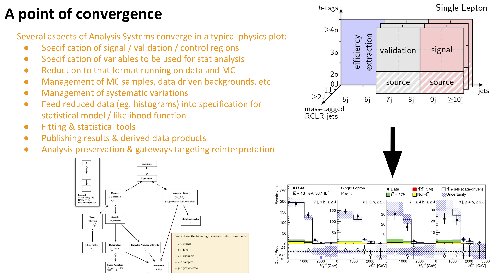

# Template Fit
Example user story for template fit with HistFitter, TRexFitter, etc. as implementations

## Introduction

User specifies high-level physics choices:

 - Specification of signal / validation / control regions (eg. cuts that define these regions) -- i.e. the "channels" in HistFactory schema
 - Specification of observables to be used for stat analysis (eg. variables to be histogrammed)
 - Specification of signal, background MC samples and data samples (with metadata for cross-sections, number of events, etc.)
 - specification of sources of systematic uncertainty (tied to a mechanism to evaluate systematic variations)
 - speciication for parameters of interest (eg. NormFactors in HistFactory scehma)
 - Statistical relationship of samples between different regions (eg. a  data-driven background shared between two regions)

 Tool then:
 - processes MC samples and data samples, applies cuts, creates histograms (or equivalent) for speficied observables
 -  repeats process for each systematic variations
 -  creates statistical model using HistFactory specification and connects histograms to their corresponding slots
 -  Performs fits, creates pre- and post-fit plots, diagnostic plots, etc.
 - Prepares likelihood, result tables, and figures for publication and archival
