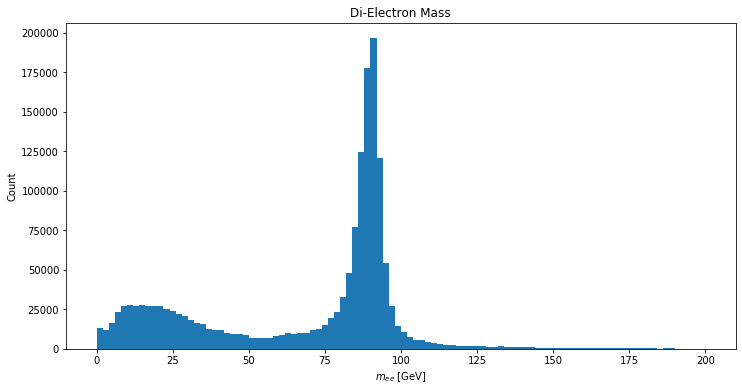

## Classic $Z\to e^+ e^-$ example

This is a simple analysis use case that focuses on basic i/o issues, 
access to fields or collumns associated to object-level data, and calculating a new 
event-level quantity. 

## CMS Open Data 

See this link http://opendata.cern.ch/record/101 .

```
Two-lepton/four-lepton analysis example of CMS 2010 open data
Rodriguez Marrero, Ana;

Cite as: Rodriguez Marrero, Ana; (2014). Two-lepton/four-lepton analysis example of CMS 2010 open data. CERN Open Data Portal. DOI:10.7483/OPENDATA.CMS.QXY9.X47P

```

Note: *Running the analysis code on the pre-processed datasets takes several hours.*


# Other implementations

## with func_adl 

This is not on the same data as the CMS OpenData Example, but same analysis use case
https://github.com/gordonwatts/func_adl_electrons/blob/master/ElectronData.ipynb




## Other

 * Coffea(awkward)+Service X (single-threaded from a single file with uproot: zpeak.ipynb, talk at HOW2019)

 * TSelector (exists and one-to-one with awkward capabilities: ZPeak.h, ZPeak.C)

 * RDataFrame (this one is more basic than the awkward and TSelector based ones, not a one-to-one comparison)

 * ATLAS Run3 EventLoop style (possible)
